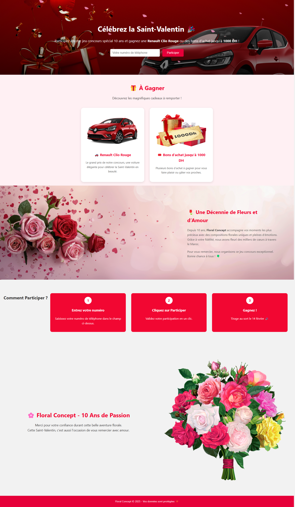

# Floral Concept 🌸

Un mini-site web conçu dans le cadre du test technique pour le poste de Développeur Front-end chez DIGITAL VIRGO MAROC.

## 🎯 Fonctionnalités

- Landing page Saint-Valentin
- Formulaire de participation
- Animations de pétales de fleurs en arrière-plan
- Responsive design
- Code HTML/CSS/JS structuré et réutilisable

## 🔍 Aperçu

## 🚀 Lancer le projet

Ouvrir simplement `index.html` dans un navigateur.